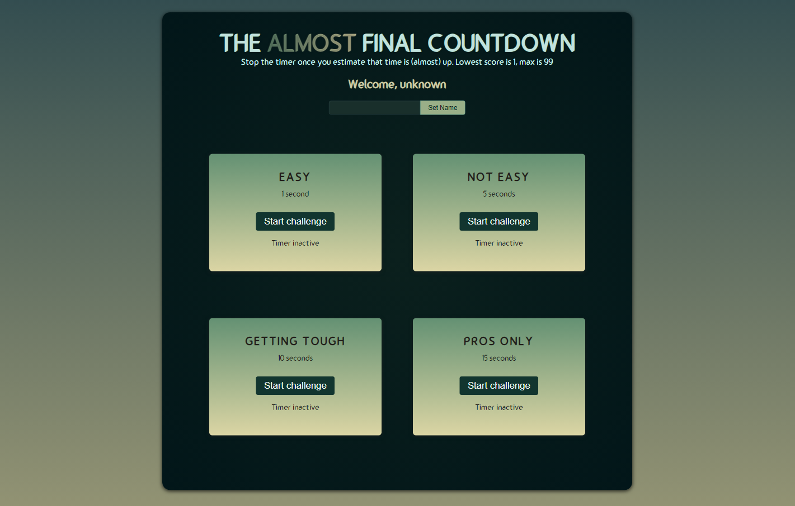

Countdown game - Stop the timer once you estimate that time is (almost) up. Lowest score is 1, max is 99.

Technologies used:

Open this link  to play it.

## image

## Available Scripts

Open the project directory and there you can type (using Git Bash):

### `npm install`
### `npm run dev`

Runs the app in the development mode.\
Open this link [http://http://localhost:5173](http://http://localhost:5173) to view it in your browser.

